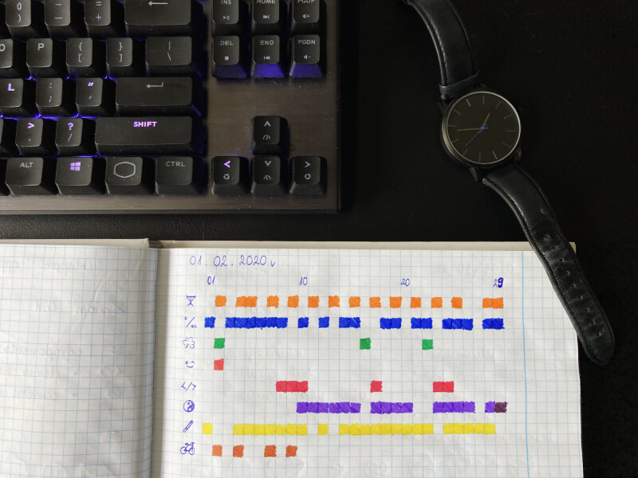

Depression was something that accompanied me for my entire life. Even now, when I'm happy, there's still this uncomfortable feeling constantly reminding me that something is out of place. Suicidal thoughts and hatred towards existence never really disappears. Whenever I'm joking about killing myself, and I do it regularly, deep down I know that not being here is something I crave a little everyday. You don't even need a reason to feel this way - currently my life couldn't get better, and still the fact that there are people that suffer because of my actions or even from anyones actions makes me want to die. The world is an unpleasant place and it's hard to deny the tragedy of being alive.

No more whining, lets get acquainted with a slightly happier perspective. It's unbelievable how pleased I am with the current state of my life. Even difficulties or any sort of the bad news can't really interfere with my mood. That's something completely new to me. I'm full of love towards myself and everything around, and I don't even have to try! I envy people who have always felt this way and wonder, where I would've be now without emotional baggage during my adolescence. No matter what the answer is, I really appreciate how I developed as a person.

What's my secret? I think that as a human we are simply just a strange creation full of chemicals. That's why I started my happiness research with focusing on what's real and proven - happy hormones. It's as easy as it sounds! To achieve emotional well-being, I just came up with a routine that would turn me into a factory of joy. For an entire year, every second day I would go for a bike ride in the woods. Few months ago I started my adventure with the dumbells and home workouts - in this case I also devoted every other day towards being fit. After every training or trip I felt invincible. It's easy to be consistent when you can see the effects of your actions right away. And although I was able to achieve short-term results instantly, I have noticed that the biggest change has happened just now. Finally I know what I am capable of - if I see an obstacle in my way, I know that the only thing stopping me from achieving my goal is me.

There's also this third thing I am doing with purpose to feel better - meditation. Sadly I'm not as consistent with sitting on my ass as I am with moving around, but I'm doing my best to spend at least 10 minutes everyday to shut my thoughts. What's more, I found meditation to be much more benefical than anything else. If you have enough willpower to not think about anything, then there's nothing that could stop you from eliminating bad thoughts whenever something inconvenient happens. Anyway being present is more like a lifestyle than something you can repeat until it works, so I'm not really sure if I have sufficient compentences to speak on this topic. For anyone interested in meditation I recommend a book called "Mindfullness in Plain English" by Henepola Gunaratana. This guy right here beautifuly describes the idea of meditation, what it does, and how to make it work. And if you're more of a visual person, I highly recommend watching animated TV serie "The Midnight Gospel" where the action begins to orbit around mindfullness as the events unfold.

With the first day of the 2020, I started to keep a journal with the actions I take everyday. I picked eight activities I do pretty often, and started to inspect my behaviour. You may see that february was harsh for my biking routine, but I made up for it in the other months with a surplus. I highly recommend keeping a bullet journal and ticking off squares - your discipline will only benefit from that.

Cheers!